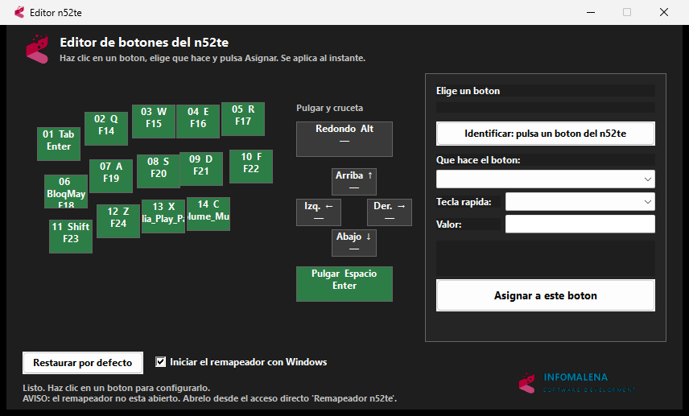
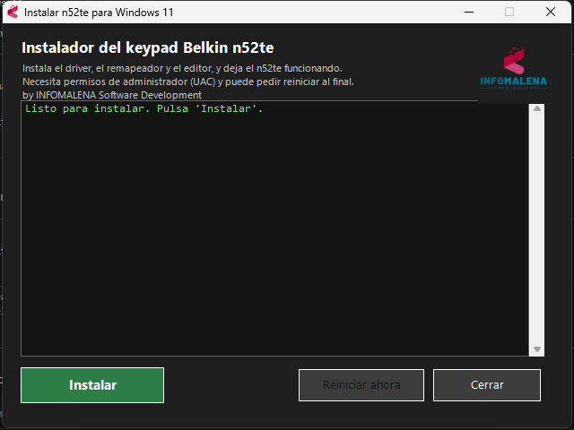

# n52te Windows 11 Driver — Belkin / Razer Nostromo n52te (Tournament Edition)

**Haz que tu keypad Belkin n52te (también conocido como Razer Nostromo n52te / n52 Tournament Edition) funcione perfectamente en Windows 11 y Windows 10 (64 bits).** Incluye un instalador con un clic, un remapeador por dispositivo (no afecta a tu teclado normal) y un editor visual de botones.

> **n52te driver for Windows 11 / Windows 10 64-bit.** Modern, working driver and key-remapping editor for the Belkin n52te / Razer Nostromo n52te gaming keypad, since the original 2008 Belkin/Razer software no longer works on modern Windows. One-click installer included.

<p align="center">
  
</p>

---

## ⬇️ Descarga rápida

1. Ve a la pestaña **[Releases](../../releases/latest)** y descarga **`Instalar-n52te.exe`**.
2. Ejecútalo (pedirá permisos de administrador).
3. Si Windows muestra *"Windows protegió tu PC"* (SmartScreen): pulsa **Más información → Ejecutar de todas formas** (es normal en software gratuito sin firma de pago).
4. Sigue las instrucciones. ¡Listo!

<p align="center">
  
</p>

📄 Instrucciones detalladas: **[INSTALL.md](INSTALL.md)**

## 🔒 Verifica que el archivo es auténtico

Como esto instala un driver, **descárgalo solo desde la [pestaña Releases oficial](../../releases/latest) de este repositorio** — nunca de webs de terceros, que podrían colar una versión modificada con malware.

Para asegurarte de que el `.exe` que has bajado es exactamente el nuestro (no manipulado), comprueba su huella **SHA-256**. Abre PowerShell en la carpeta de descargas y ejecuta:

```powershell
Get-FileHash .\Instalar-n52te.exe -Algorithm SHA256
```

El resultado debe coincidir **exactamente** con este (también en el archivo [`Instalar-n52te.exe.sha256`](Instalar-n52te.exe.sha256)):

```
8946926B10325A9F095E3BE3E661A0B87E46BC0B340333D570557E2239A7EB18
```

Si no coincide, **no lo ejecutes**: el archivo no es el original.

---

## ❓ ¿Por qué hace falta esto?

El **Belkin n52te** (y su gemelo **Razer Nostromo n52te**) es un mítico keypad para juegos de 2008. El software oficial de Belkin/Razer (`n52te v2.1.2`, de julio de 2008) está pensado para Windows XP/Vista y **su driver ya no carga en Windows 11** (la *Integridad de memoria* / HVCI bloquea drivers tan antiguos), así que el editor de perfiles original muestra *"n52te not connected"* y no puedes reprogramar los botones.

**El dispositivo en sí funciona** como teclado en Windows 11 (teclea lo que tenga grabado), pero no puedes reconfigurarlo. Este proyecto resuelve eso con software moderno.

## ✨ Qué incluye

- **🎮 Separación real por dispositivo**: solo se remapean las teclas del n52te. Tu teclado normal sigue escribiendo con total normalidad, sin lag ni interferencias. (Usa el driver [Interception](https://github.com/oblitum/Interception), compatible con la Integridad de memoria de Windows 11.)
- **🖱️ Editor visual**: los 14 botones + pulgar + cruceta dibujados con la forma real del dispositivo. Haz clic en un botón, elige qué hace y guarda — se aplica al instante.
- **⌨️ Cada botón puede ser**: una tecla (incluso F13–F24 sin conflictos), una combinación/macro (`Ctrl+C`, `Alt+Tab`…), escribir un texto, o abrir un programa o web.
- **🔍 Identificar**: pulsa un botón físico y se selecciona solo en el editor.
- **🚀 Inicio con Windows** opcional, en segundo plano.
- **📦 Instalador con un clic** que limpia restos del driver antiguo de Belkin, instala el driver y deja todo funcionando.

## 🧩 Compatibilidad

| | |
|---|---|
| **Dispositivo** | Belkin n52te · Razer Nostromo n52te · n52 Tournament Edition (`VID_050D&PID_0200`) |
| **Sistema** | Windows 11 y Windows 10 (64 bits) |
| **Requisitos** | Permisos de administrador para instalar el driver |

## 🛠️ Cómo funciona (técnico)

- El n52te se enumera como un teclado HID normal. Para remapear **solo** sus teclas sin tocar el teclado físico hace falta filtrar a nivel de driver: se usa el driver de kernel **Interception** (firmado y compatible con HVCI).
- Un servicio en segundo plano (`n52te_interception.exe`) lee cada pulsación, comprueba si viene del n52te (`VID_050D`) y, si es así, emite la acción configurada; cualquier otro teclado pasa intacto.
- El editor (`Editor n52te.exe`) escribe la configuración en `%ProgramData%\n52te\n52te_config.ini`, que el remapeador recarga automáticamente.

## 🙏 Créditos y licencias de terceros

- **[Interception](https://github.com/oblitum/Interception)** por Francisco Lopes (oblitum) — driver de captura de entrada (gratuito para uso no comercial).
- **[AutoHotkey v2](https://www.autohotkey.com/)** — el editor está compilado con AutoHotkey.
- Driver original y dispositivo: **Belkin International** / **Razer**.

El código de este proyecto se publica bajo licencia **MIT** (ver [LICENSE](LICENSE)).

## ⚠️ Aviso

Proyecto **no oficial** y **sin afiliación** con Belkin ni Razer. "n52te", "Nostromo", "Belkin" y "Razer" son marcas de sus respectivos propietarios y se usan solo de forma descriptiva. Software proporcionado *tal cual*, sin garantía. Reactivar drivers antiguos o desactivar protecciones del sistema es bajo tu responsabilidad.

---

<p align="center">
  <br>
  <sub>Hecho por <b>INFOMALENA</b> · Software Development</sub>
</p>
